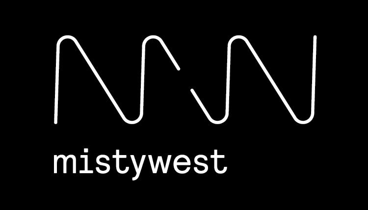

# WWF ARGOS Tracker


This is the open-source repo for Polar Bear Tracker designed by MistyWest and IDEO for the World Wildlife Fund and US Fish & Wildlife Services. 
For more information see the [blog post](https://www.mistywest.com/posts/project/wwf-polar-bear-tracker/) from MistyWest on the project.


FWS |  MW | WWF
:-------------------------:|:-------------------------:|:-------------------------:
  |   | 

# Usage Guide

## Quick Start
### EE
- [Design Files](Electrical/Design%20Files)
- [PCB Output Files](Electrical/PCB%20Output%20Files)
### ME
- [Mold Files](Mechanical/Mold%20v3)
### FW
- [Bootloader](Firmware/wwf_bootloader)
- [Firmware](Firmware/ww02Firmware)
    > 1. Initially the board need to be flash using a J-link \
      2.  Any addtionally changes can be be done with the NRF Connect app
      >


## main.c

This is the starting/jump off point for the code. All major threads are started/initialized here.  
You can control the sequence of thread start-up or enable/disable threads via 
```
project_settings.h
```

## Logging/CLI
These are actually two different components.  
CLI is a command line interface which allows for manual
control.  This can be used for debugging and/or user interface.  You can send Text to the terminal
through API called seen in:
```
mw_cli_thread.h
```

Logging is primary for debugging code during development. A wrapper is created around the Nordic SDK
Logging module.  it must be enabled in the SDK config file, where you can also specify either a UART 
or RTT (J-Link) physical interface. This should be a different interface than CLI
```
sdk_config.h

#define NRF_LOG_ENABLED 1

#define NRF_LOG_BACKEND_UART_ENABLED (0:1)

#define NRF_LOG_BACKEND_RTT_ENABLED (0:1)
```

## ADC
The ADC thread uses the Nordic SAADC peripheral driver and is provided as an example of ADC usage.
SAADC must be enabled in the SDK Config file
```
sdk_config.h

#define NRFX_SAADC_ENABLED 1
```

## Current Status:
- Device only works when compiled under DEBUG mode in the Makefile.  Core issue is related to the interface between the nRF52 and ARTIC chip.


## Documentation

Doxygen is used to build the source code documentation. Go to the [downloads page](http://www.doxygen.nl/download.html), scroll down to **Sources and Binaries** and select the latest archive for Linux, Windows, or Mac.

Or if on Linux, just do:

```
sudo apt install doxygen
```

To build the documentation:

```
cd _docs/
doxygen
```

Then use your browser to open `_docs/html/index.html`.


## Contributors
MistyWest
- Kevin Lockwood
- Daniel Law
- Fred Huang
- Victor Hu
- John Turner
- Sean Edmond
- Justin Lam
- Nathan Van Rumpt
- Ryan Wilson
- Michelle St. Martin
- Elisabeth Kruger
- Kayvon Shakeri
- Peter Bronk
- Remy Pieron
- Phil Tsao
